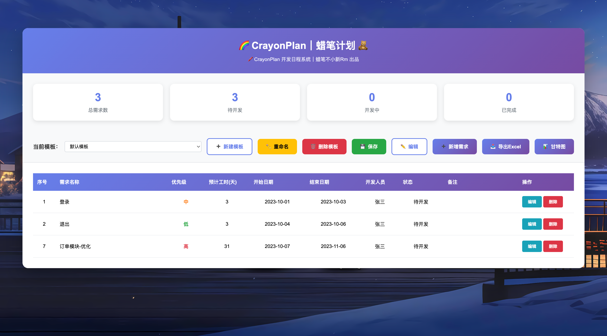
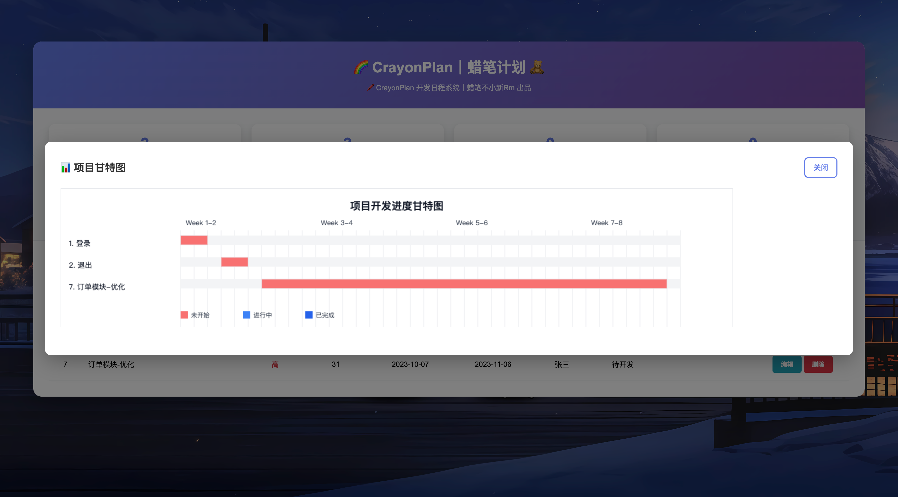

# 🖍️ CrayonPlan｜蜡笔计划 🧸

> 「用蜡笔描绘开发的节奏。」—— by 蜡笔不小新Rm

---

## 💫 关于我
大家好，我是 [蜡笔不小新 Rm]  
🎯 金融科技开发者 | 技术探索者  
💡 专注于金融领域的软件开发与技术实践

## 📝 今日箴言
> "停止抱怨，开始改变。这世界不缺旁观者，只缺行动者"
>

## 🎯 项目简介

**CrayonPlan｜蜡笔计划** 是一个轻量级的前端项目开发日程管理系统，集 **需求管理、模板切换、Excel 导出、甘特图可视化** 于一体。  
它以直观的 UI 和色彩明快的设计，让开发排期、任务进度和甘特图展示更具条理性与美感。  

适用于：
- 项目经理追踪开发进度  
- 独立开发者规划任务  
- 团队周会展示项目状态  
- 教学或演示前端可视化作品  

---

## ✨ 主要功能

| 功能模块 | 说明 |
|-----------|------|
| 📋 **需求管理** | 支持任务新增、编辑、删除、优先级、状态等字段管理 |
| 🧩 **模板系统** | 多模板独立存储，支持重命名与删除，方便不同项目切换 |
| 💾 **数据存储** | 使用内存存储机制，数据在当前会话中实时保存 |
| 📊 **甘特图可视化** | 动态生成开发进度甘特图，色彩明快，结构清晰 |
| 📈 **统计卡片** | 自动汇总总任务数、待开发、开发中、已完成数量 |
| 📤 **Excel 导出** | 一键导出当前模板任务列表为 Excel 文件（带样式） |

---

## 🖼️ 界面展示

| 首页概览 | 甘特图展示 |
|-----------|-------------|
|  |  |

> 🌈 注：截图仅作样式展示，实际渲染根据任务数据动态生成。

---

## 🚀 快速启动

### ✅ 打开方式

1. 克隆项目：
   ```bash
   git clone https://gitlab.com/your-namespace/CrayonPlan.git

   ## 📚 知识资源库
### 🚀 代码仓库
🏗️ **地址：**[https://github.com/iMalingtong](https://github.com/iMalingtong)

👾 日常编程实践、项目原型与工具demo的集散地

### 🌐 语雀知识花园
📖 **地址：** [https://www.yuque.com/shenquan-fjbti](https://www.yuque.com/shenquan-fjbti)  
✨ 包含技术文档、学习笔记、项目总结

### 🗂️ ProcessOn 思维导图
📊 **地址：** [https://www.processon.com/u/617e2fd91efad41d03f5f486](https://www.processon.com/u/617e2fd91efad41d03f5f486)  
🎨 技术架构、学习路线、知识体系可视化

## 🎯 核心价值
**探索技术之美，分享编程之趣**  
在这里，我们一起：

+ 🚀 探讨前沿技术
+ 💡 分享实战经验
+ 🌱 记录成长点滴

## 🎯 加入成长之旅
**关注我，一起：**

+ 📈 提升技术能力
+ 💼 拓展职业视野
+ 🤝 交流行业见解
+ 🚀 实现共同成长

_✨__ 每天进步一点点，成就更好的自己 __✨_
